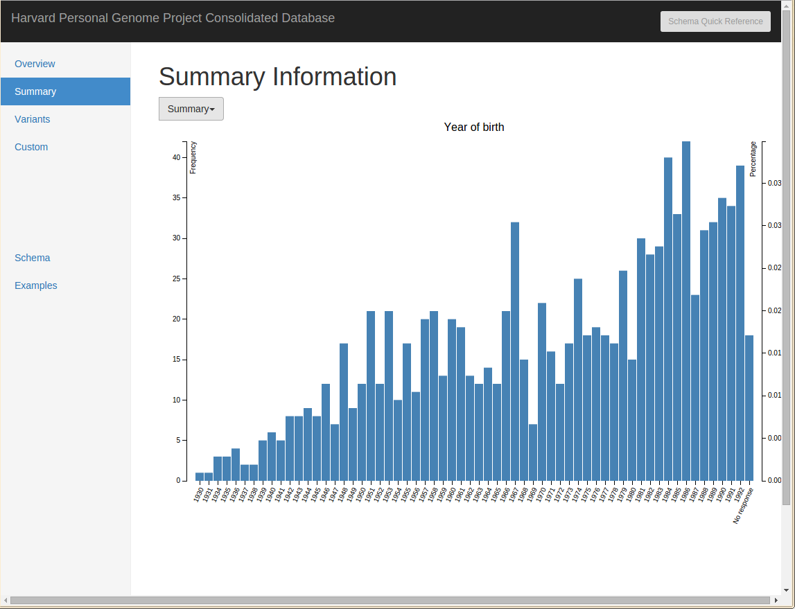
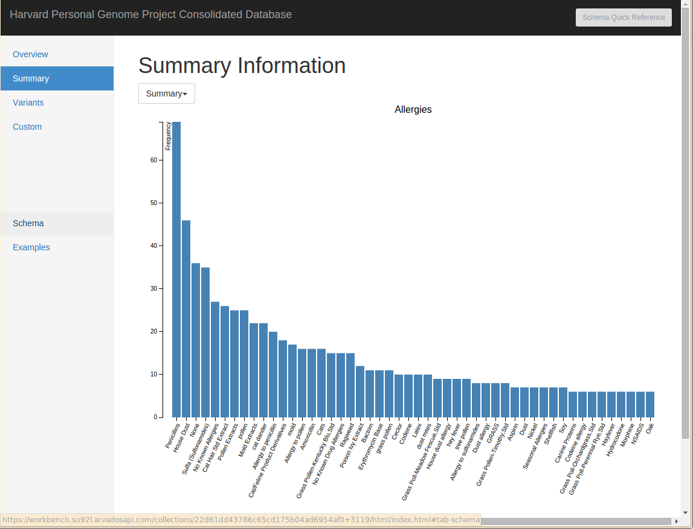
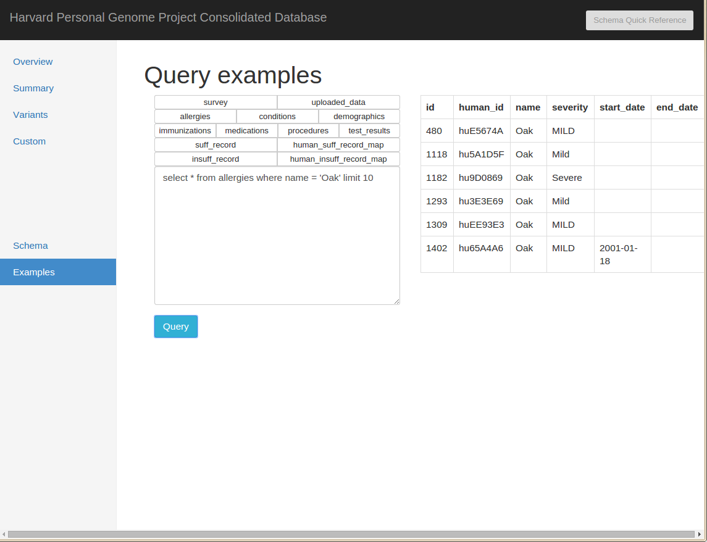
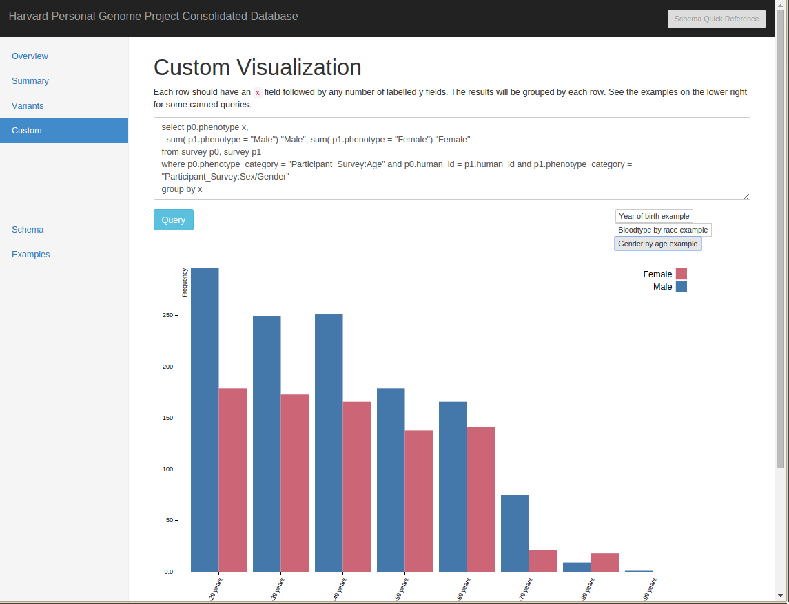
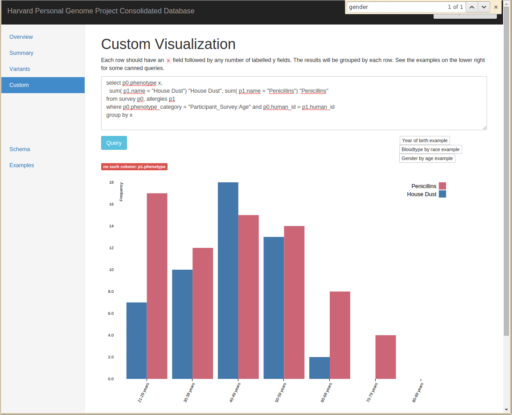
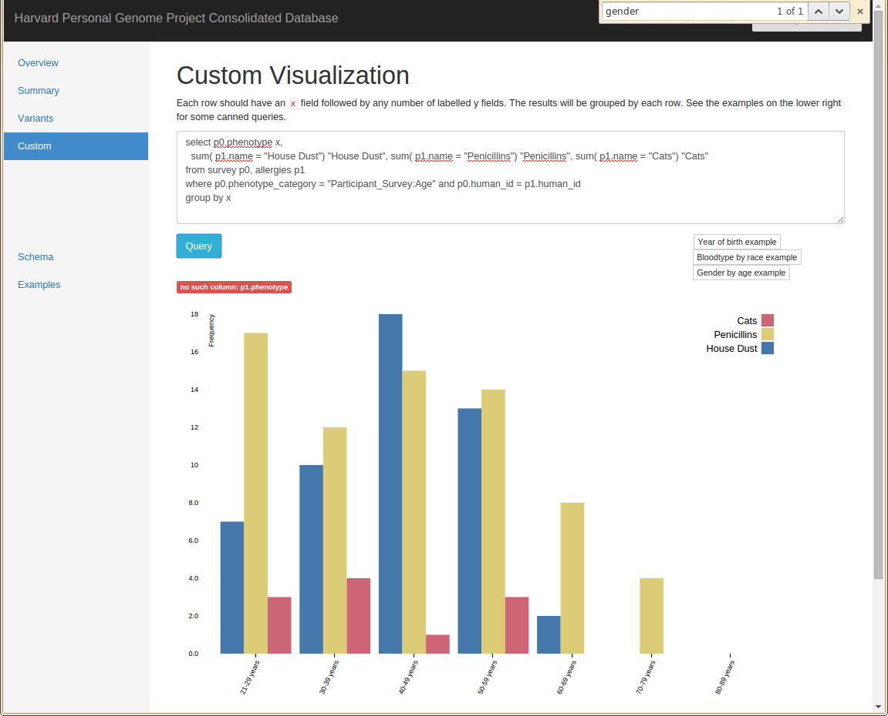

# Introduction

Here's a quick introduction to what you can do with Untap. 

What is Untap? We scraped the phenotypes in the Harvard Personal Genome Project and made it available in a small SQLite database, publicly available for anyone to download. We made a small webapp around the database where people can play around with the data directly in their browser.

Webapp (first page has link to gzip of the database): http://curoverse.link/22d61dd43786c65cd175b04ad6954af0+3119/html/index.html 

**Note: The website will take a few seconds to load the first time around.**

## Dataset

The dataset consists of people who have completed the enrollment process and were free to upload their own data for public release and also answer the surveys online (but not necessarily people who have donated samples, had the samples sequence, or had the samples released publicly).

To put it concretely, there are around **4000 people enrolled**, and around **200 people with whole genome sequences** that were  sequenced, interpreted, and returned by Harvard PGP as of August 2015 (though keep your ears open for upcoming news). (Participants may have whole genomes sequenced independently and then elect to upload and donate the data to the Harvard PGP).
webapp

Returning to the webapp, there are a few default tabs, where you can do things like explore what year PGP participants were born, where you can see that our population is mostly young folks…

## “Summary” Pre-Packaged View of Allergies of Participants

…or with two clicks see what allergies are most common in PGP participants. Note that this is a quick scrape of the Tapestry database and no clean-up has been done, so you’ll notice allergies being listed twice with different spellings.

### SQL Queries for Participants with “Oak” Allergies

On the “queries” tab, you can query the sql database and see the results in neat table form in your browser.

Additionally, there are some pre-packaged but interactive visualizations, where you can edit the text and have the graph update to reflect your changes / newly requested data.

For instance, here’s a display of the participant gender ratio at different ages which I modify to display information about the allergies at different age buckets

### Before, displaying gender of participants

### and After, displaying penicillin and house dust allergies

## Obligatory cat statistics

Although one could hope that this graph shows that PGP participants are not more likely to develop allergies to cats as they grow older, we have a lot more younger participants and this is absolute and not percent frequency, so we might have to say the data points to the opposite. Sad!

(Disclaimer: Just for fun, no real thought put into this analysis :] )

## Conclusion

**Ever wanted a public genotype + phenotype dataset? The Harvard PGP has you covered!**

We have [phenotype surveys galore](https://my.pgp-hms.org/google_surveys) (including a recently released one that includes blood type and eye color), with responses available in CSV form. The questions on the survey forms are [available on github](https://github.com/PGPHarvard/pgp-surveys) for now.

I hope you all enjoy! Untap is on github

* https://github.com/abeconnelly/untap 

and we welcome feature requests / issue reporting. We hope this is beneficial to the [GA4GH working groups](http://ga4gh.org/) specifically and other researchers in general.
